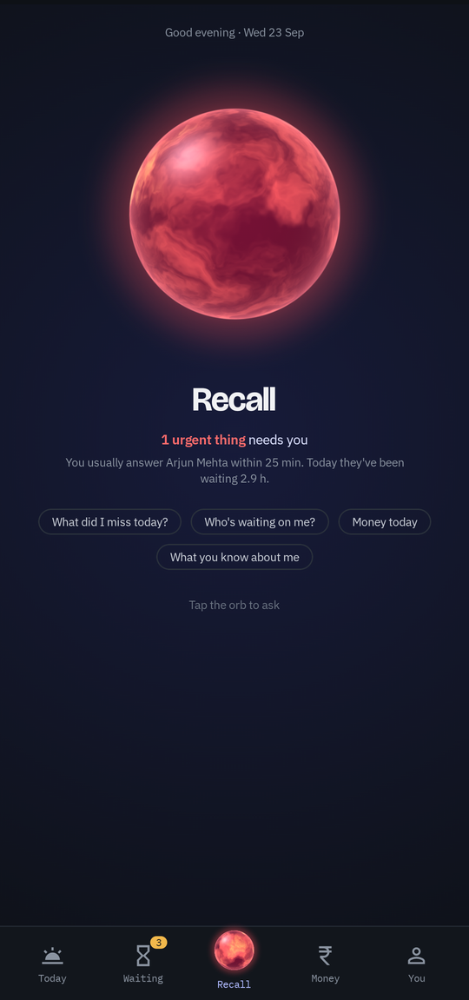
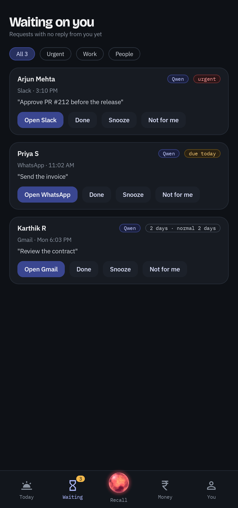
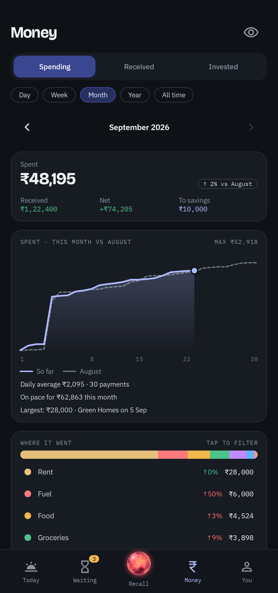
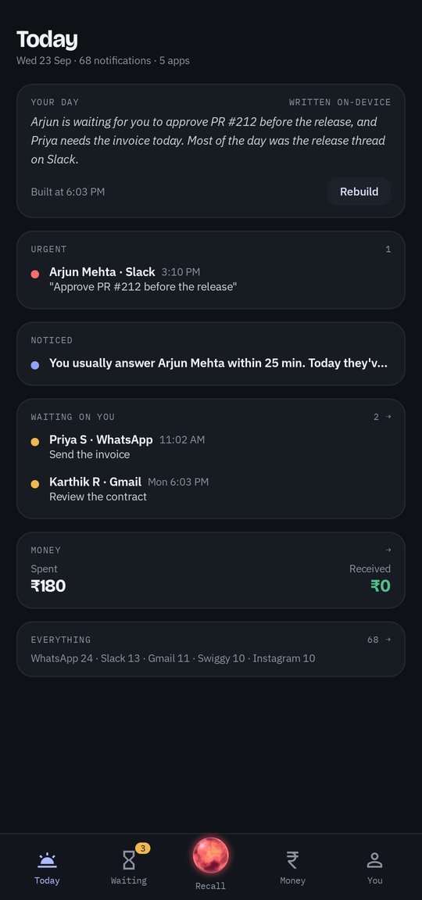

# Recall

An Android app that reads every notification, remembers who's waiting on you, and tracks where your money went. The AI runs on your phone. Nothing leaves it.

<p>
  
  
  
  
</p>

**[Download the APK](https://github.com/Juni-crypto/recall/releases/latest)** · [Website](https://juni-crypto.github.io/recall/) · [Contribute](CONTRIBUTING.md)

## What it does

- **Waiting on you.** "can u approve this pr quick?" stays on a list until you reply or tap Done. "Quick", "urgent" and deadlines push it up.
- **9:30 PM digest.** One notification every night: what's urgent, who's waiting, what you spent.
- **Money.** Reads bank SMS, UPI and card alerts. Spending, received and invested, compared month to month. Transfers between your own accounts don't count.
- **Ask.** "what did Rahul want yesterday?" Answers link back to the notifications they came from.
- **Learns you.** Reply habits per person, what you ignore, what you mark done. Everything it learned is on one screen, and you can delete any of it.
- **Widget and lock-screen card.** What needs you, at a glance.

A local model (Qwen3 or Llama 3.2 via [llama.cpp](https://github.com/ggml-org/llama.cpp)) reads each message and decides whether it needs you. Rules handle the rest, and SQL does every sum.

## Private by design

- No server, no account, no analytics.
- The model file is the only download. It's pinned by SHA-256.
- The **Offline** edition has no internet permission at all. You import the model file yourself.

## Install

1. Get the APK from [Releases](https://github.com/Juni-crypto/recall/releases/latest). Choose `standard` to download the model in the app, or `offline` for no internet permission.
2. Grant notification access, then set battery to Unrestricted.
3. Pick a model. Recall suggests one for your phone's RAM (0.4 to 2.5 GB).

Android 10+ on ARM64. A phone with 8 GB of RAM or more is best.

> Preview builds are signed with a debug key. Updates will need a reinstall until a release key is set up.

## Build

You need JDK 17+ and an Android SDK with Platform 37, NDK 27.1.12297006 and CMake 3.22.1.

```bash
git clone --recursive https://github.com/Juni-crypto/recall
cd recall
./gradlew assembleOnlineDebug    # or assembleOfflineDebug
```

The first build compiles llama.cpp for each ARM CPU generation, so it takes a few minutes.

## Limits

- It sees notifications, not the messages you send. If you replied inside the app, tap Done.
- Android 15+ hides OTP-like notifications, and that can include bank alerts. Allow SMS access and Recall reads those from SMS instead.
- Learning needs about two weeks of history before it beats the default rules.

## License

[Apache 2.0](LICENSE). llama.cpp is MIT. Each model has its own license.
